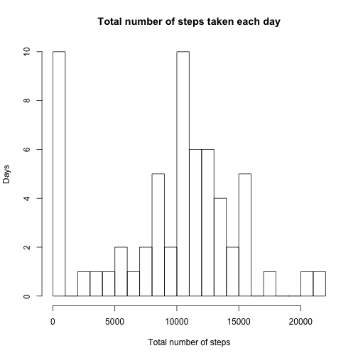
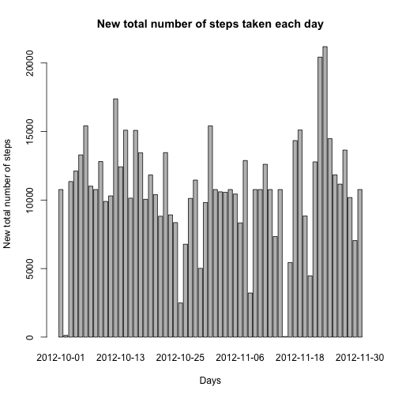
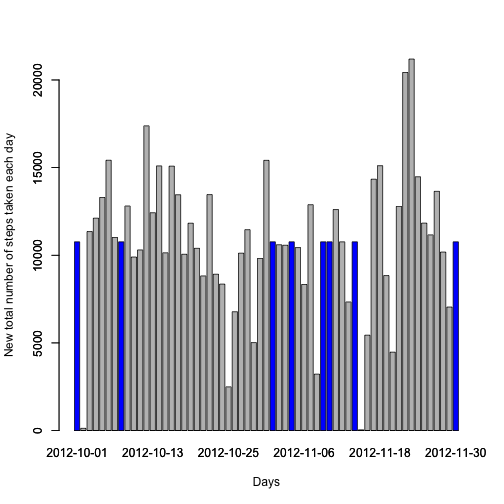

For my peer to review this assessment as easily as possible, I had to set
**knitr**'s options accordingly.


```r
## Set UK locale
Sys.setlocale("LC_TIME", "en_GB")
```

```
## [1] "en_GB"
```

```r
## Set global options
library(knitr)
opts_chunk$set(echo = TRUE)

## Write a function to print nice tables with xtable
library(xtable)
niceTable <- function(x) {
        xt <- xtable(x)
        print(xt, type = "html")
}
```

# Reproducible Research: Peer Assessment 1

## Loading and preprocessing the data

### Unzipping and loading the data file
I unzipped (when necessary) and loaded the data using the `unzip` and
`read.csv` commands:


```r
fileName <- "activity.csv"
zipfileName <- "activity.zip"

## Unzip zip file if necessary
if(!file.exists(fileName))
        unzip(zipfileName)

activity <- read.csv(fileName)
```

### Preprocessing

```r
## Get the total number of steps per date (ignoring NA)
activityPerDate <- split(activity$steps, activity$date)
totalStepsPerDate <- sapply(activityPerDate, sum, na.rm = TRUE)

## Get the number steps per interval, averaged accross all days (ignoring NAs)
activityPerInterval <- split(activity$steps, activity$interval)
meanStepsPerInterval <- sapply(activityPerInterval, mean, na.rm = TRUE)
```

## What is mean total number of steps taken per day?

1. First I made a histogram of the total number of steps taken each day.


```r
hist(totalStepsPerDate,
     xlab = "Total number of steps",
     ylab = "Days",
     breaks = 20,
     main = "Total number of steps taken each day")
```

 

Even if it was not part of the assignment, I also wanted to see a barplot of this data.


```r
barplot(totalStepsPerDate,
        xlab = "Total number of steps",
        ylab = "Days",
        main = "Total number of steps taken each day")
```

 

2. Then I calculated the mean and median total number of steps taken per day.


```r
meanTotalStepsPerDate <- mean(totalStepsPerDate, na.rm = TRUE)
meanTotalStepsPerDate
```

```
## [1] 9354.23
```

```r
medianTotalStepsPerDate <- median(totalStepsPerDate, na.rm = TRUE)
medianTotalStepsPerDate
```

```
## [1] 10395
```

So the results of these calculations were that:

- the **mean** total number of steps taken per day is
  **9354.2295082**;

- the **median** total number of steps taken per day is
  **10395**.

## What is the average daily activity pattern?

1. First, I made a time series plot (i.e. type = "l") of the 5-minute interval
(x-axis) and the average number of steps taken, averaged across all days
(y-axis).


```r
plot(names(meanStepsPerInterval),
     meanStepsPerInterval,
     type = "l",
     xlab = "5-minute intervals",
     ylab = "Average number of steps taken",
     main = "Average number of steps taken per interval")
```

 

2. Then I calculated the 5-minute interval, on average across all the days in
the dataset, that contains the maximum number of steps.


```r
whichMaxStepsPerInterval <- names(which.max(meanStepsPerInterval))
whichMaxStepsPerInterval
```

```
## [1] "835"
```

```r
maxMeanStepsPerInterval <- max(meanStepsPerInterval)
maxMeanStepsPerInterval
```

```
## [1] 206.1698
```

And here is the result of these calculations: the 5-minute interval, on average
across all the days in the dataset, that contains the maximum number of steps
is **the 835 interval**.

**This maximum is 206.1698113**.

It appears to be exact:


```r
meanStepsPerInterval[as.character(whichMaxStepsPerInterval)] == maxMeanStepsPerInterval
```

```
##  835 
## TRUE
```

```r
plot(names(meanStepsPerInterval),
     meanStepsPerInterval,
     type = "l",
     xlab = "5-minute intervals",
     ylab = "Average number of steps taken",
     main = "Maximum average number of steps taken per interval")

abline(v = whichMaxStepsPerInterval,
       col = "blue",
       lty = 2,
       lwd = 2)

abline(h = maxMeanStepsPerInterval,
       col = "blue",
       lty = 2,
       lwd = 2)
```

 

## Imputing missing values

1. First of all, I calculated the total number of missing values in the dataset (i.e. the total number of rows with `NA`s).


```r
numberOfMissingValues <- nrow(activity) - nrow(na.exclude(activity))
numberOfMissingValues
```

```
## [1] 2304
```

Therefore, we know that there are **2304 missing values**.

I could have relied on the `summary` function:


```r
summary(activity)[7]
```

```
## [1] "NA's   :2304  "
```

2. Then I decided that I would replace missing values in the dataset by the mean
for that 5-minute interval.


```r
getMeanForInterval <- function(interval)
        as.data.frame(meanStepsPerInterval)[as.character(interval), ]
```

For example:


```r
getMeanForInterval(5)
```

```
## [1] 0.3396226
```

```r
getMeanForInterval(835)
```

```
## [1] 206.1698
```

```r
getMeanForInterval(1200)
```

```
## [1] 63.86792
```

3. Afterwards I created a new dataset that is equal to the original dataset but
with the missing data filled in.


```r
## Copy the original dataset
newActivity <- activity

for(i in seq_along(newActivity$steps)) {
        if(is.na(newActivity$steps[i]))
                newActivity$steps[i] <- getMeanForInterval(newActivity$interval[i])
        }

summary(newActivity)
```

```
##      steps                date          interval     
##  Min.   :  0.00   2012-10-01:  288   Min.   :   0.0  
##  1st Qu.:  0.00   2012-10-02:  288   1st Qu.: 588.8  
##  Median :  0.00   2012-10-03:  288   Median :1177.5  
##  Mean   : 37.38   2012-10-04:  288   Mean   :1177.5  
##  3rd Qu.: 27.00   2012-10-05:  288   3rd Qu.:1766.2  
##  Max.   :806.00   2012-10-06:  288   Max.   :2355.0  
##                   (Other)   :15840
```

4. a) I made a histogram of the total number of steps taken each day


```r
## Get the total number of steps per date
newActivityPerDate <- split(newActivity$steps, newActivity$date)
newTotalStepsPerDate <- sapply(newActivityPerDate, sum, na.rm = TRUE)

## Draw the new histogram without highlighting the differences
hist(newTotalStepsPerDate,
     xlab = "New total number of steps",
     ylab = "Days",
     breaks = 20,
     main = "New total number of steps taken each day")
```

 

We clearly see the difference.

A barplot (not asked in the assignment) also shows this difference, but another way.


```r
## Draw the new barplot without highlighting the differences
barplot(newTotalStepsPerDate,
        ylab = "New total number of steps",
        xlab = "Days",
        main = "New total number of steps taken each day")
```

 

I also wanted to highlight the differences.


```r
## Draw the new barplot highlighting the differences
barplot(totalStepsPerDate,
        ylab = "New total number of steps taken each day",
        xlab = "Days",
        ylim = range(totalStepsPerDate))

par(new=TRUE)

barplot(newTotalStepsPerDate - totalStepsPerDate,
        col = "blue",
        ylim = range(totalStepsPerDate))
```

 

b) I calculated the new mean and median total number of steps taken per day.


```r
newMeanTotalStepsPerDate <- mean(newTotalStepsPerDate, na.rm = TRUE)
newMeanTotalStepsPerDate
```

```
## [1] 10766.19
```

```r
newMedianTotalStepsPerDate <- median(newTotalStepsPerDate, na.rm = TRUE)
newMedianTotalStepsPerDate
```

```
## [1] 10766.19
```

c) The results of these calculations were that:

- the **new mean** total number of steps taken per day is
  **1.0766189 &times; 10<sup>4</sup>**;

- and the **new median** total number of steps taken per day is
  **1.0766189 &times; 10<sup>4</sup>**.

d) I wondered whether these values differed from the estimates from the first
part of the assignment.

So I made a comparison table.


```r
comparisonTable <- matrix(c(meanTotalStepsPerDate,
                            medianTotalStepsPerDate,
                            newMeanTotalStepsPerDate,
                            newMedianTotalStepsPerDate,
                            newMeanTotalStepsPerDate - meanTotalStepsPerDate,
                            newMedianTotalStepsPerDate - medianTotalStepsPerDate),
                          nrow = 2,
                          ncol = 3,
                          dimnames = list(c("Mean", "Median"),
                                          c("Old", "New", "Difference (new - old)")
                                          )
                          )

niceTable(comparisonTable)
```

<!-- html table generated in R 3.2.1 by xtable 1.7-4 package -->
<!-- Mon Jul 20 00:30:06 2015 -->
<table border=1>
<tr> <th>  </th> <th> Old </th> <th> New </th> <th> Difference (new - old) </th>  </tr>
  <tr> <td align="right"> Mean </td> <td align="right"> 9354.23 </td> <td align="right"> 10766.19 </td> <td align="right"> 1411.96 </td> </tr>
  <tr> <td align="right"> Median </td> <td align="right"> 10395.00 </td> <td align="right"> 10766.19 </td> <td align="right"> 371.19 </td> </tr>
   </table>

So **yes, these values do differ from the estimates from the first part of the
assignment**.

e) This done, I had a closer look at the data and noticed that data was missing
for 8 whole days. The data for each 5-minute interval in these 8 days were
replaced by the average per according 5-minute interval. So these missing days
data are identical.

However, this operation should not have had an effect on the global average.

Indeed, you can add as many times the average of a set of values to this set of
values, it won't alter the average, as the average is:
$$A = \frac{S}{n}$$
but also
$$A = \frac{(S + k*A)}{(n+k)}$$

(where $S$ is the sum of a set of $n$ values, $A$ being their average and $k$
the additional number of occurrences of $A$ you want to add to the set)

As a conclusion, as announced by Dr. Peng, **`NA`s have an impact on computations done using the `mean` and `median` functions**.

## Are there differences in activity patterns between weekdays and weekends?

1. I created a new `dayFactor` factor variable in the dataset with two levels –
“weekday” and “weekend” indicating whether a given date is a weekday or weekend
day.


```r
Days <- weekdays(as.Date(newActivity$date))

isWeekday <- function(day) {
        if(day == "Saturday" |
                   day == "Sunday") {
                "weekend"
                } else "weekday"

}

dayFactor <- sapply(Days, isWeekday)
factorredActivity <- data.frame(newActivity, dayFactor)

factorredActivityPerDayFactor <- split(factorredActivity,
                                       factorredActivity$dayFactor)

averagedFactorredActivity <- sapply(activityPerInterval, mean, na.rm = TRUE)
```

2. Then I made a panel plot containing a time series plot of the 5-minute
interval (x-axis) and the average number of steps taken, averaged across all
weekday days or weekend days (y-axis).

To do so, as I did not manage to directly plot the data I needed, I had to
subset the data into to data frames, one for week-ends and one for weekdays.


```r
weekdayActivity <- sapply(split(factorredActivityPerDayFactor[[1]]$steps,
                                factorredActivityPerDayFactor[[1]]$interval),
                          mean)

weekendActivity <- sapply(split(factorredActivityPerDayFactor[[2]]$steps,
                                factorredActivityPerDayFactor[[2]]$interval),
                          mean)

fullWeekendData <- data.frame(as.vector(weekendActivity),
                              as.numeric(names(weekendActivity)),
                              rep("weekend", 288))

colnames(fullWeekendData) <- c("steps", "interval", "dayFactor")

fullWeekdayData <- data.frame(as.vector(weekdayActivity),
                              as.numeric(names(weekdayActivity)),
                              rep("weekday", 288))

colnames(fullWeekdayData) <- c("steps", "interval", "dayFactor")

fullData <- rbind(fullWeekdayData, fullWeekendData)
```

It is a bit ugly but it worked!


```r
library(lattice)
xyplot(fullData$steps ~ fullData$interval
       | fullData$dayFactor,
       type = "l",
       layout = c(1, 2),
       xlab = "Interval",
       ylab = "Number of steps")
```

 
